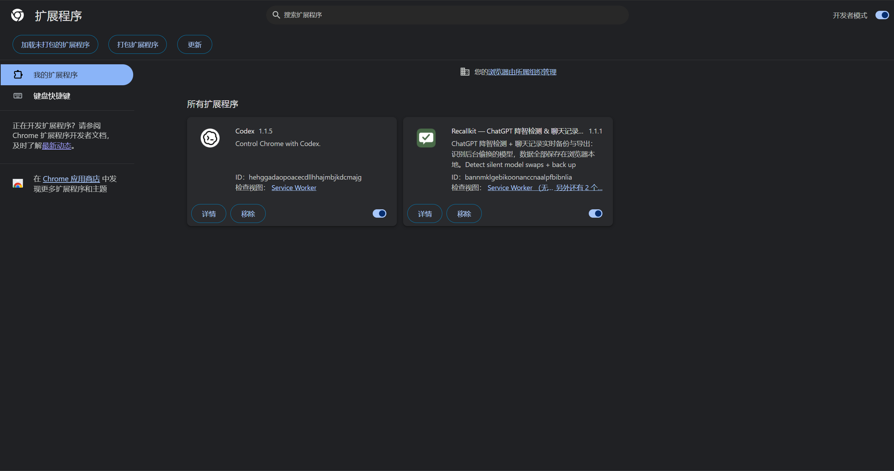
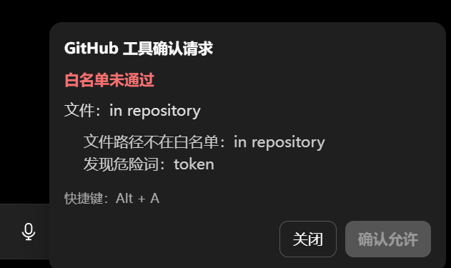
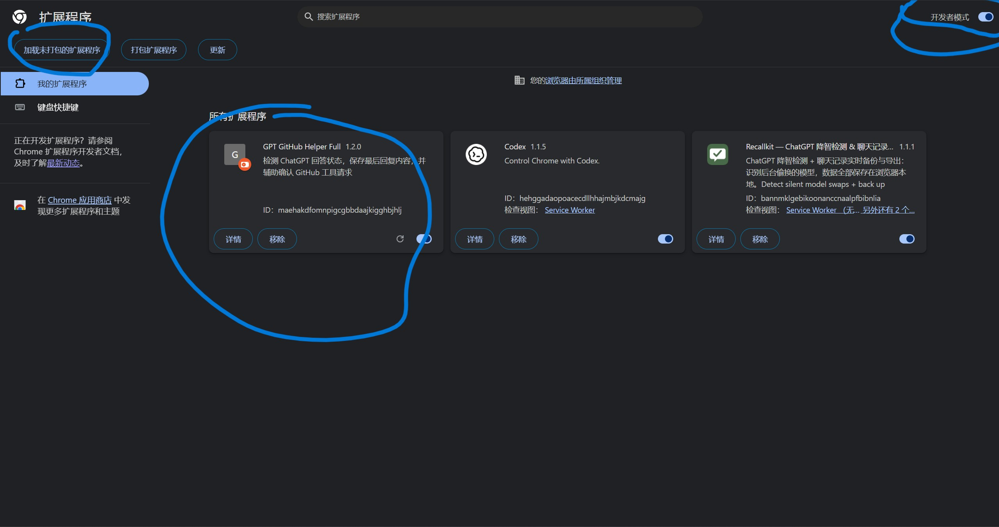
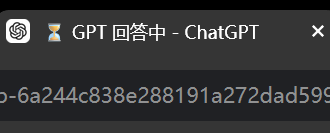
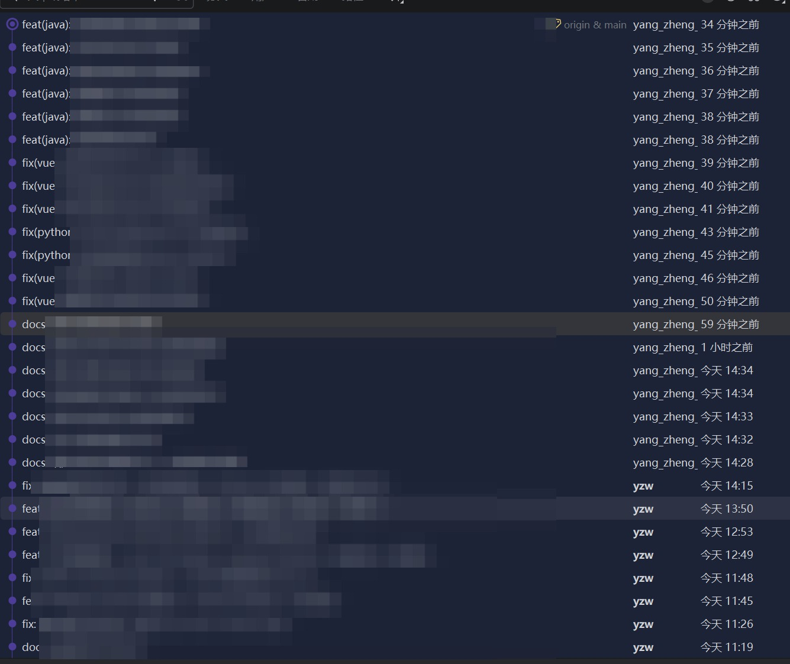

# GPT GitHub Helper Full

这是一个 Chrome 插件 + 本地 Python 服务组合工具。

## 功能

### Chrome 插件功能

- 检测 ChatGPT 是否正在回答
- 回答中修改标题为：

```text
⏳ GPT 回答中 - ChatGPT
```

- 回答结束修改标题为：

```text
✅ GPT 已结束 - ChatGPT
```

- 回答结束后读取最后一条 GPT 回复
- 把用户最后提问和 GPT 最后回复发送到本地服务
- 检测 GitHub 工具确认请求
- 根据仓库、操作、禁止分支、禁止路径做安全校验
- 安全校验通过后，右侧中间弹窗提示并自动确认
- 安全校验未通过时，右侧中间弹窗红色提示原因，也可手动点击“仍然确认”
- 安全校验通过后，也可按快捷键：

```text
Alt + A
```

### 本地服务功能

- 接收插件发送的 GPT 回复
- 保存为 Markdown 文件
- 检测到 GitHub 请求时保存日志
- Windows 下弹窗提醒
- 可扩展调用自己的 exe / bat / Java 程序

---

## 目录结构

```text
gpt-github-helper-full/
├─ chrome-extension/
│  ├─ manifest.json
│  ├─ config.js
│  ├─ page_reader.js
│  ├─ local_api.js
│  ├─ github_prompt.js
│  ├─ safety_check.js
│  ├─ panel.js
│  └─ content.js
├─ local-server/
│  ├─ local_notify_server.py
│  ├─ requirements.txt
│  └─ start_server.bat
└─ README.md
```

---

## 第一步：启动本地服务

进入目录：

```text
local-server
```

双击：

```text
start_server.bat
```

或者手动执行：

```bash
pip install -r requirements.txt
python local_notify_server.py
```

启动成功后，浏览器访问：

```text
http://127.0.0.1:18888/health
```

看到下面内容说明成功：

```json
{
  "success": true,
  "message": "GPT 本地通知服务运行中"
}
```

---

## 第二步：安装 Chrome 插件

打开 Chrome：

```text
chrome://extensions/
```

然后：

1. 打开右上角「开发者模式」
2. 点击「加载已解压的扩展程序」
3. 选择：

```text
chrome-extension
```

注意：选择的是 `chrome-extension` 文件夹，不是整个压缩包。





---

## 第三步：使用

打开 ChatGPT 页面。



当 GPT 正在回答时，标题会变成：

```text
⏳ GPT 回答中 - ChatGPT
```

当 GPT 回答结束后，标题会变成：

```text
✅ GPT 已结束 - ChatGPT
```

同时本地服务会保存回复到：

```text
local-server/gpt_replies/
```

日志在：

```text
local-server/logs/
```



---

## GitHub 快捷确认

插件默认只允许指定仓库和操作类型快捷确认，同时会拦截禁止分支、禁止路径和危险词。

### 仓库

```text
wuzheng-yang/ai_gp_v2
```

### 不允许操作的分支

```text
main
```

### 操作

```text
Update GitHub file
Create GitHub file
```

### 不允许修改的文件夹或文件名

```text
.env
node_modules/
dist/
build/
```

### 危险词

出现这些词时，不允许快捷确认：

```text
.env
```

其他危险词可在 `chrome-extension/config.js` 的 `dangerWords` 中按需开启。



---

## 修改安全规则

打开：

```text
chrome-extension/config.js
```

修改插件配置：

```js
window.GptGithubHelper.config = {
  localServerBaseUrl: 'http://127.0.0.1:18888',
  allowedRepos: [
    'wuzheng-yang/gpt-github-helper'
  ],
  blockedBranches: ['main'],
  allowedActions: ['Update GitHub file', 'Create GitHub file'],
  blockedPaths: ['.env', 'node_modules/', 'dist/', 'build/'],
  dangerWords: ['.env']
};
```

修改后需要在 Chrome 扩展页面点击刷新插件。

---

## 调用你自己的本地程序

打开：

```text
local-server/local_notify_server.py
```

找到：

```python
def call_your_program(event_type: str, markdown_file: Optional[Path] = None):
```

把里面改成：

```python
subprocess.Popen([
    r"D:\your_app\notify.exe",
    event_type,
    str(markdown_file or "")
], shell=False)
```

这样 GPT 回答结束后，会自动调用你的程序，并把 Markdown 文件路径传进去。

---

## 注意

1. 插件从 ChatGPT 页面 DOM 读取内容，不是官方 API。
2. 如果 ChatGPT 页面结构变化，可能需要调整 `page_reader.js` 或 `github_prompt.js` 里的选择器。
3. 插件不会无条件自动点击 GitHub 允许按钮。
4. GitHub 请求安全校验通过后会自动确认；未通过时需要手动点击“仍然确认”。
5. 本地服务必须先启动，插件才能保存回复。
